# Strange Portafolio

🔗 **Deploy:** https://tp1-grupo-17-hawkins-dev-com-d-26.vercel.app/index.html

> *"Bienvenidos a nuestro pueblo. Descubre las habilidades de nuestros expertos."*

Este es el primer trabajo práctico grupal, diseñado como un portafolio web interactivo inspirado en el universo de **Stranger Things**. 
Su objetivo es presentar a nuestro equipo de desarrollo, mostrando una dualidad en la interfaz de usuario: un "Mundo Real" (Hawkins) y un mundo oscuro y alternativo ("The Upside Down"). 

El sitio incluye funcionalidades dinámicas como un cargador inicial (loader) temático, y un sistema de temas (Claro/Oscuro) que no solo cambia los colores y fondos, sino también las imágenes, descripciones y roles de cada perfil, adaptándolos a cada "dimensión".

---

## 👥 Integrantes

- **Lorena Cohene Baez** - <a href="https://github.com/LorenaCoheneBaez" target="_blank">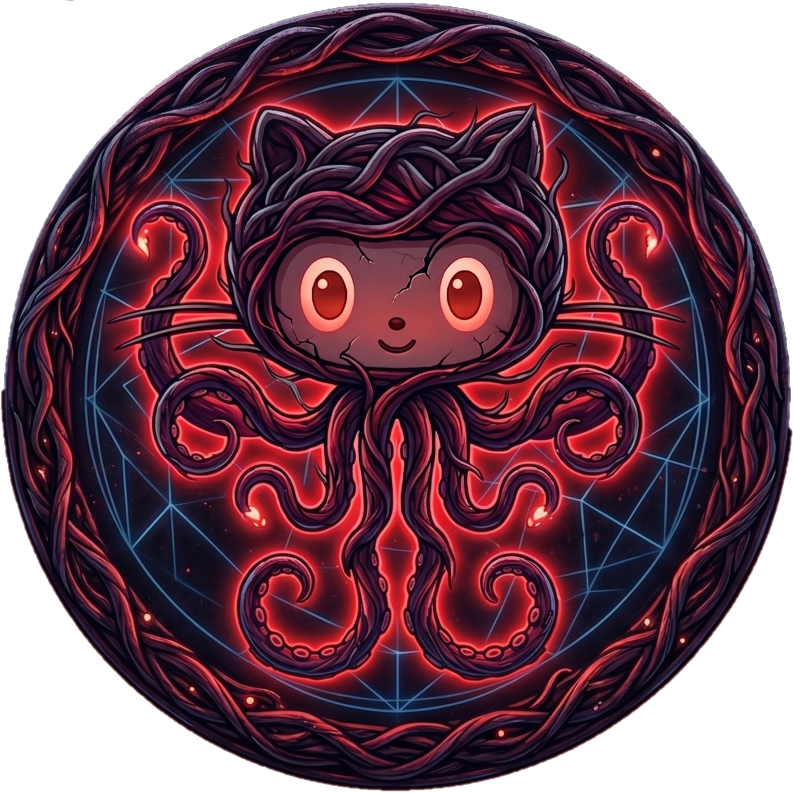</a>
- **Gisela Colmeiro (Gisse)** - <a href="https://github.com/gissestephy" target="_blank"></a>
- **Cristian Vivar** - <a href="https://github.com/ecvivar" target="_blank"></a>
- **Cristina Murguía** - <a href="https://github.com/crismurbaez" target="_blank"></a>

---

## 🛠️ Tecnologías Utilizadas

- **HTML5** - Estructurado y semántico.
- **CSS3** - Estilos, Flexbox/Grid, transiciones, animaciones y filtros.
- **JavaScript (Vanilla)** - Manipulación del DOM, lógica del tema y cambio de contenido dinámico.
- **Google Fonts** - *Orbitron* e *Inter*.
- **Animate.css** - Para las animaciones dinámicas del título principal.
- **Fuente Personalizada** - *Bolton* (Para simular la tipografía original de Stranger Things).

---

## 📁 Estructura de Archivos

```text
/
├── index.html           # Página principal (Portada y presentación)
├── bitacora.html        # Página de bitácora
├── profile-*.html       # Páginas individuales de perfiles (Max, Nancy, Robin, Steve)
├── css/
│   ├── styles.css       # Hoja de estilos principal del sitio
│   └── font/            # Tipografías locales (Bolton.ttf)
├── js/
│   └── script.js        # Lógica de interactividad, cambio de modo y datos dinámicos
└── img/                 # Avatares, logos, iconos y fondos adaptados a cada dimensión
```

---

## 🎨 Guía de Estilos

### Paleta de Colores
- **Fondos principales**: `#0d0d0e` (Base oscura para el Upside Down).
- **Textos**: `#FFFFFF` (Blanco puro), `#000000` (Negro), `#CCCCCC` (Gris claro para subtítulos).
- **Acentos (Rojo Stranger Things)**: 
  - Primario: `#FF0000` 
  - Secundario: `#e50914`
  - Resaltado: `#ff2a2a` y `#b30000`

### Tipografía
- **Títulos Temáticos**: [Bolton Font](https://www.dafont.com/es/bolton.font) (Cargada localmente con `@font-face`).
- **Títulos Secundarios / Interfaz**: [Orbitron](https://fonts.google.com/specimen/Orbitron) (Google Fonts).
- **Cuerpo y Descripciones**: [Inter](https://fonts.google.com/specimen/Inter) (Google Fonts).

### Iconografía e Imágenes
- Utilizamos imágenes `.png` y `.jpg` personalizadas para íconos de interacción (ej: botones de modo `btn_down.png`, `btn_up.png`).
- Los avatares fueron generados por **Inteligencia Artificial** manteniendo la estética ochentera y sombría de la serie, garantizando la privacidad de los integrantes.

---

## ⚡ JavaScript: Funcionalidades Dinámicas

El archivo [js/script.js](./js/script.js) maneja toda la interactividad de la página, principalmente enfocada en la transición entre dimensiones:

1. **Gestor de Tema (`applyTheme` y EventListener en el botón de toggle)**:
   - *¿Qué hace?* Alterna la clase `light` o `dark` en el `body` de las páginas y lo guarda en `localStorage` para recordar la elección del usuario en toda su navegación.
   - *Ubicación*: Se ejecuta a nivel global a través de [js/script.js](./js/script.js), aplicado a todas las páginas y se ubica en la esquina superior derecha.
   <br>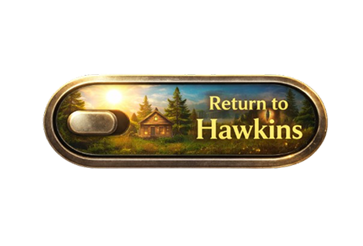
   <br>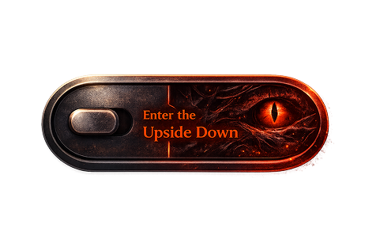

2. **Loader Temático**:
   - *¿Qué hace?* Detecta qué modo está activo y muestra un cargador inicial ("Bienvenidos" vs "Bienvenido al infierno") que desaparece con un *fade out* luego de 1.2 segundos.
   - *Ubicación*: Lógica en [js/script.js](./js/script.js), aplicado en todos los archivos HTML (divs con id `loader` y `loader-dark`).

   📸 *Captura del Loader inicial:*
   <br>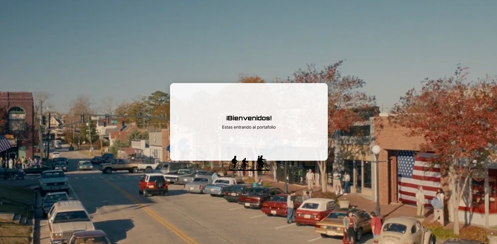
   <br>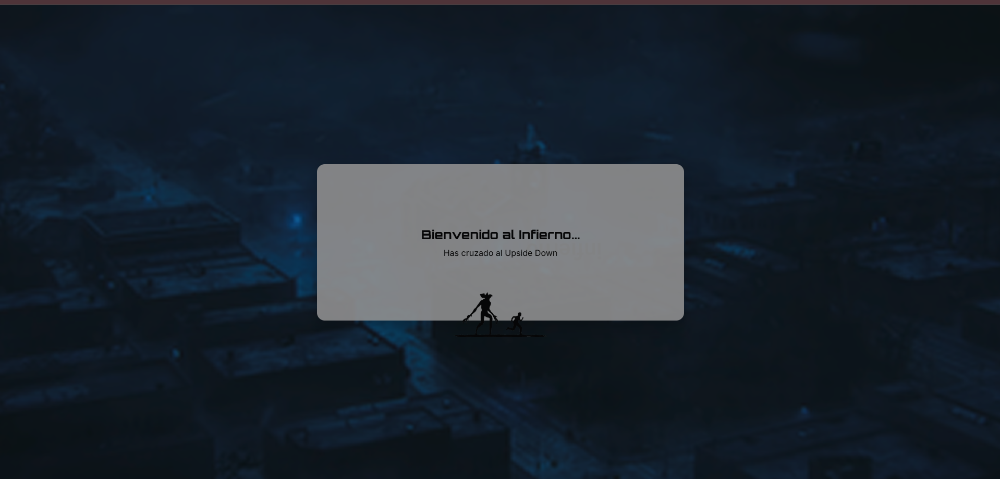

3. **Animaciones Dinámicas (`updateTitleAnimation(isDark)`)**:
   - *¿Qué hace?* Alterna animaciones de la librería *Animate.css* sobre el título principal ("pulse" para el modo claro y la agresiva "hinge" para el modo oscuro).
   - *Ubicación*: Lógica en [js/script.js](./js/script.js), aplicado en [index.html](./index.html).
   <br>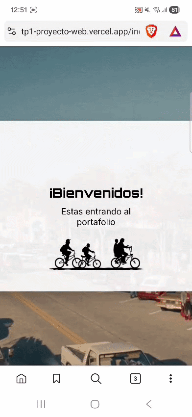
   <br>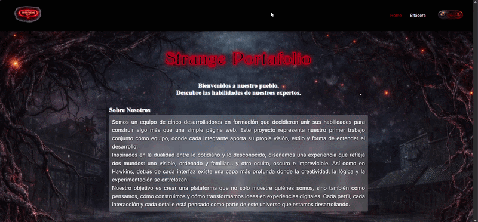

4. **Tarjetas de Portada (`updateCardImages(isDark)`)**:
   - *¿Qué hace?* Cambia las imágenes (avatar normal a versión "corrompida") y los **textos de los roles** (ej: Front-end Developer a Reality Breaker) en las *cards* de presentación de la Home, leyendo los atributos `data-light` y `data-dark`.
   - *Ubicación*: Lógica en [js/script.js](./js/script.js), aplicado en [index.html](./index.html).
   <br>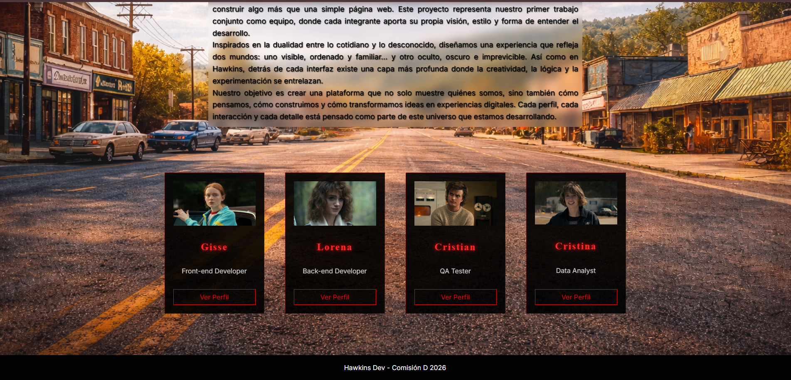
   <br>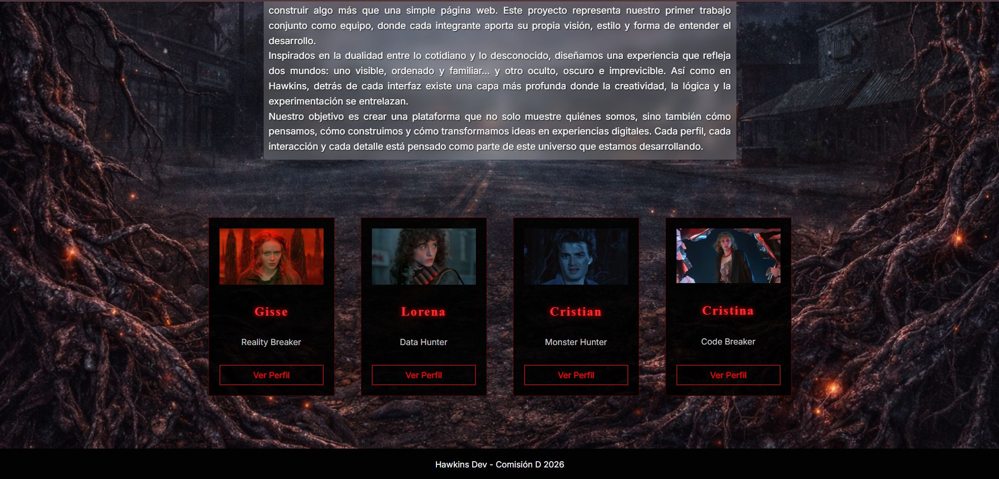

5. **Perfiles Dinámicos (`updateProfile(isDark)`)**:
   - *¿Qué hace?* Cambia el contenido interno de la página de perfil (Imagen, Rol, Frase destacada, Descripción y Habilidades) dependiendo del modo activado, obteniendo los datos de un objeto `profiles`.
   - *Ubicación*: Lógica en [js/script.js](./js/script.js), aplicado en [profile-max.html](./profile-max.html), [profile-nancy.html](./profile-nancy.html), [profile-robin.html](./profile-robin.html) y [profile-steve.html](./profile-steve.html).

   📸 *Captura de ejemplo del modo light - dark y cambio de textos:*
   <br>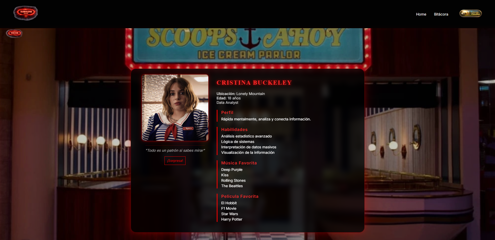
   <br>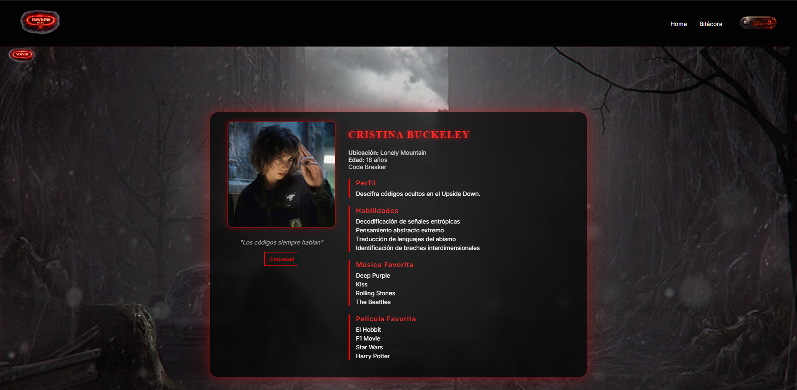


6. **Animación Sorpresa (Jump Scare - FLIP)**:
   - *¿Qué hace?* Controla el botón "¡Sorpresa!". Al hacer clic, utiliza la técnica **FLIP** mediante JavaScript para inyectar un GIF temático que ocupa exactamente el 100% de la pantalla (100vw/100vh) sin deformarse. Luego, calcula matemáticamente las coordenadas de la tarjeta y hace que la imagen "vuele" hacia su posición final, respetando todas las Media Queries.
   - *Ubicación*: Lógica de animación calculada íntegramente en [js/script.js](./js/script.js), aplicado en páginas individuales.

   📸 *Captura de la animación sorpresa:*
   <br>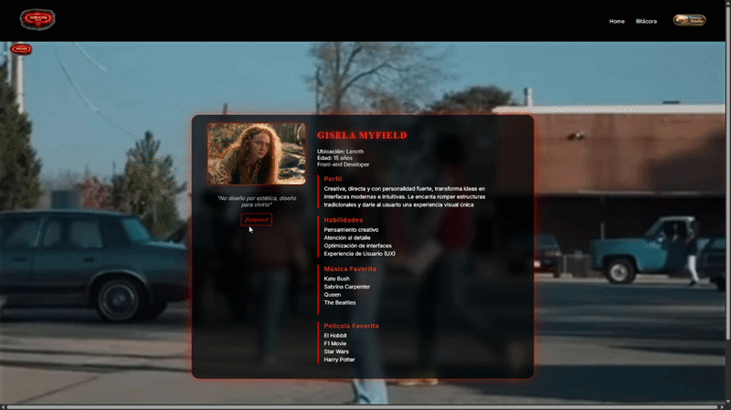
   <br>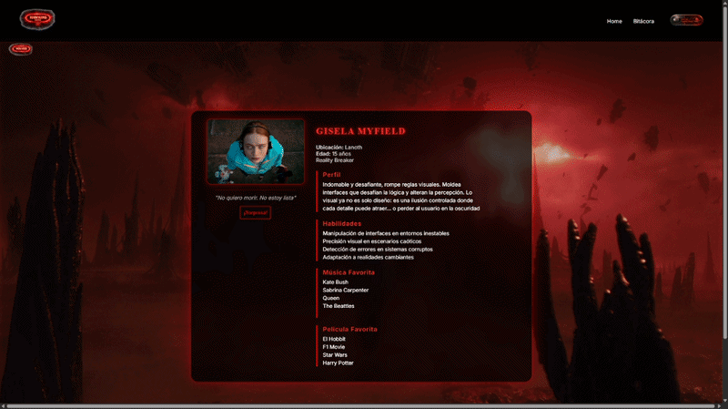

---

## 🚀 Enlace al Proyecto Desplegado

- **Vercel**:https://tp1-grupo-17-hawkins-dev-com-d-26.vercel.app/index.html


---

## 🤖 Requerimiento Obligatorio: Uso de IA

Este proyecto ha integrado Inteligencia Artificial en distintas fases de su ciclo de vida, tanto para el contenido creativo como para el desarrollo lógico.

- **Herramientas utilizadas**: 
  - *Generación de código y debug*: Gemini, ChatGPT.
  - *Generación de imágenes*: Midjourney / DALL-E (Bing Image Creator).
- **Uso en Contenido y Código**: 
  - La IA fue utilizada para redactar la historia y descripción temática de cada perfil (creando su dualidad de personaje normal vs versión oscura del Upside Down).
  - En programación, se utilizó como soporte para estructurar la base del objeto JS que guarda las versiones dinámicas de los textos (`profiles`), y para dar formato específico a los efectos CSS de niebla (`filter: blur`) y parpadeo de luces rojas.
- **Imágenes**: 
  - Se definieron *prompts* solicitando estilo *"retro 80s, stranger things style character, soft light"* para el modo claro, y *"stranger things upside down corrupted character, red glowing, dark theme"* para el modo oscuro. Esto nos permitió una cohesión estética impecable sin vulnerar la privacidad del equipo.
