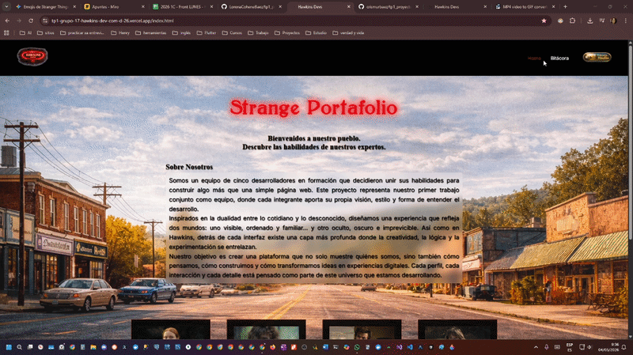
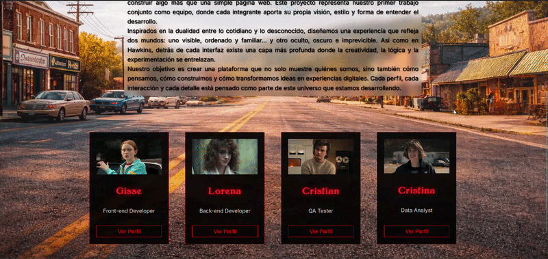
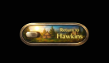
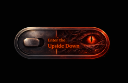
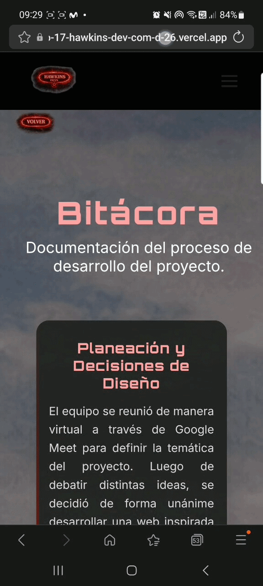

# Strange Portafolio

🔗 **Deploy:** https://tp1-grupo-17-hawkins-dev-com-d-26.vercel.app/index.html

> *"Bienvenidos a nuestro pueblo. Descubre las habilidades de nuestros expertos."*

Este es el primer trabajo práctico grupal, diseñado como un portafolio web interactivo inspirado en el universo de **Stranger Things**. 
Su objetivo es presentar a nuestro equipo de desarrollo, mostrando una dualidad en la interfaz de usuario: un "Mundo Real" (Hawkins) y un mundo oscuro y alternativo ("The Upside Down"). 

El sitio incluye funcionalidades dinámicas como un cargador inicial (loader) temático, y un sistema de temas (Claro/Oscuro) que no solo cambia los colores y fondos, sino también las imágenes, descripciones y roles de cada perfil, adaptándolos a cada "dimensión".

---

## 👥 Integrantes

- **Lorena Cohene Baez** - <a href="https://github.com/LorenaCoheneBaez" target="_blank"></a>
- **Gisela Colmeiro (Gisse)** - <a href="https://github.com/gissestephy" target="_blank"></a>
- **Cristian Vivar** - <a href="https://github.com/ecvivar" target="_blank"></a>
- **Cristina Murguía** - <a href="https://github.com/crismurbaez" target="_blank"></a>

---

## 🛠️ Tecnologías Utilizadas

- **HTML5** - Estructurado y semántico.
- **CSS3** - Estilos, Flexbox/Grid, transiciones, animaciones y filtros.
- **JavaScript (Vanilla)** - Manipulación del DOM, lógica del tema y cambio de contenido dinámico.
- **Google Fonts** - *Orbitron* e *Inter*.
- **Animate.css** - Para las animaciones dinámicas del título principal.
- **Fuente Personalizada** - *Bolton* (Para simular la tipografía original de Stranger Things).

---

## 📁 Estructura de Archivos

```text
/
├── index.html           # Página principal (Portada y presentación)
├── bitacora.html        # Página de bitácora
├── profile-*.html       # Páginas individuales de perfiles
├── css/
│   ├── styles.css       # Hoja de estilos principal del sitio
│   └── font/            # Tipografías locales (Bolton.ttf)
├── js/
│   └── script.js        # Lógica de interactividad, cambio de modo y datos dinámicos
└── img/                 # Avatares, logos, iconos y fondos adaptados a cada dimensión
```

### 📝 Sección Bitácora
El proyecto incluye una página dedicada ([bitacora.html](./bitacora.html)) donde se documenta el proceso de desarrollo, cumpliendo con los requerimientos del TP1:
- **Planeación y Diseño**: Proceso de elección de la temática y asignación de personajes/roles.
- **Dificultades**: Resolución de problemas con la organización de datos dinámicos y carga de fuentes externas.
- **Cambios**: Ajustes realizados en la lógica de temas y optimización de componentes durante la implementación.

*Gif de la Bitácora*
<br>

---

## 🎨 Guía de Estilos

### Paleta de Colores
- **Fondos principales**: `#0d0d0e` (Base oscura para el Upside Down).
- **Textos**: `#FFFFFF` (Blanco puro), `#000000` (Negro), `#CCCCCC` (Gris claro para subtítulos).
- **Acentos (Rojo Stranger Things)**: 
  - Primario: `#FF0000` 
  - Secundario: `#e50914`
  - Resaltado: `#ff2a2a` y `#b30000`

### Tipografía
- **Títulos Temáticos**: [Bolton Font](https://www.dafont.com/es/bolton.font) (Cargada localmente con `@font-face`).
- **Títulos Secundarios / Interfaz**: [Orbitron](https://fonts.google.com/specimen/Orbitron) (Google Fonts).
- **Cuerpo y Descripciones**: [Inter](https://fonts.google.com/specimen/Inter) (Google Fonts).

### Iconografía e Imágenes
- Utilizamos imágenes `.png` y `.jpg` personalizadas para íconos de interacción (ej: botones de modo `btn_down.png`, `btn_up.png`).
- Los avatares fueron generados por **Inteligencia Artificial** manteniendo la estética ochentera y sombría de la serie, garantizando la privacidad de los integrantes.

### 📱 Diseño Responsivo (Media Queries)
El proyecto utiliza un enfoque *Desktop-First* (diseño primero para escritorio y luego adaptación hacia abajo) implementando las siguientes Media Queries en [css/styles.css](./css/styles.css) para garantizar una experiencia fluida en cualquier dispositivo:

- **Escritorio y Laptops Pequeñas (`max-width: 1200px`)**:
  - Se optimiza el espaciado general. Las tarjetas de la grilla principal (`.card`) y del perfil (`.profile-card`) reducen levemente su tamaño para no colisionar.
  - El logo del encabezado se ajusta para ahorrar espacio vertical.
  <br>

- **Tablets y Pantallas Medianas (`max-width: 900px`)**:
  - **Navegación**: La barra de enlaces superior se oculta y es reemplazada por un **Menú Hamburguesa** (interactivo vía JS). Al abrirlo, el menú se despliega verticalmente.
  - **Layout de Perfiles**: Las tarjetas de perfil (`.profile-card`), que originalmente dividían avatar e información en dos columnas, colapsan en **una sola columna vertical** (centrando imagen y texto).
  - La grilla principal (`.grid`) pasa a mostrarse en una sola columna para facilitar el scroll.
  - Se reducen los tamaños tipográficos de los títulos en la sección Bitácora.
  <br>

- **Dispositivos Móviles Pequeños (`max-width: 400px`)**:
  - Las tarjetas (`.card`) pasan a ocupar el 90% del ancho de la pantalla móvil.
  - Reducción agresiva de tipografías (nombres de perfil, citas y descripciones) para evitar desbordes de texto.
  - Los botones interactivos (como el de "Volver" o "¡Sorpresa!") reducen su escala y reposicionan sus coordenadas absolutas para mantenerse siempre accesibles.
  <br>

---

## ⚡ JavaScript: Funcionalidades Dinámicas

El archivo [js/script.js](./js/script.js) gestiona la interactividad del sitio. Para facilitar la corrección, se dividen las funciones según su alcance:

### 🌍 Global (Todas las páginas)

1. **Gestor de Tema (`applyTheme` y botón de toggle)**:
   - *¿Qué hace?* Alterna la clase `light` o `dark` en el `body` y lo persiste en `localStorage`.
   - *Ubicación*: Esquina superior derecha de todas las páginas.

  *Captura del toggle en modo light y dark:*
   <div align="center">
     
     
   </div>

2. **Loader Temático**:
   - *¿Qué hace?* Muestra un cargador inicial adaptado al modo activo ("Bienvenidos" vs "Bienvenido al infierno") con un efecto *fade out* luego de 1.2 segundos.

  *Captura del Loader: en modo light y dark:*
    

3. **Menú Hamburguesa (Interactividad Responsiva)**:
   - *¿Qué hace?* Gestiona la apertura y cierre del menú de navegación en dispositivos móviles (tablets y celulares).
   - *Ubicación*: Header de todas las páginas (visible en `< 900px`).

*Gif del Menú Hamburguesa:*



### 🏠 Portada (index.html)

4. **Animaciones Dinámicas del Título (`updateTitleAnimation`)**:
   - *¿Qué hace?* Alterna entre un "pulse" suave y una animación de "bisagra" (hinge) agresiva según el modo.

   Gif del título en modo light y dark:
    

5. **Tarjetas de Presentación (`updateCardImages`)**:
   - *¿Qué hace?* Cambia imágenes de perfil y textos de roles (ej: "QA Tester" a "Monster Hunter") dinámicamente.

   *Captura de Tarjetas Dinámicas: en modo light y dark:*
    

### 👤 Páginas Individuales (profile-*.html)

6. **Perfiles Dinámicos (`updateProfile`)**:
   - *¿Qué hace?* Actualiza todo el contenido de la tarjeta de presentación (Imagen, Rol, Frase, Descripción y Habilidades) desde un objeto central de datos.
   - **Estructura Obligatoria**: Cada tarjeta incluye Foto, Nombre, Ubicación, Edad, Habilidades (mín. 4), Películas (mín. 3) y Discos (mín. 3).

   *Captura del Perfil Dinámico en modo light y dark:*
    

7. **Animación Sorpresa (Técnica FLIP)**:
   - *¿Qué hace?* Activa un "Jump Scare" temático que ocupa la pantalla completa y luego vuela hacia su posición en la tarjeta usando cálculos matemáticos de coordenadas.
   
   *Gif de Sorpresa en modo light y dark:*
    

---

## 🚀 Enlace al Proyecto Desplegado

- **Vercel**:https://tp1-grupo-17-hawkins-dev-com-d-26.vercel.app/index.html


---

## 🤖 Requerimiento Obligatorio: Uso de IA

Este proyecto ha integrado Inteligencia Artificial en distintas fases de su ciclo de vida, tanto para el contenido creativo como para el desarrollo lógico.

- **Herramientas utilizadas**: 
  - *Generación de código y debug*: Gemini, ChatGPT.
  - *Generación de imágenes*: Midjourney / DALL-E (Bing Image Creator).
- **Uso en Contenido y Código**: 
  - La IA fue utilizada para redactar la historia y descripción temática de cada perfil (creando su dualidad de personaje normal vs versión oscura del Upside Down).
  - En programación, se utilizó como soporte para estructurar la base del objeto JS que guarda las versiones dinámicas de los textos (`profiles`), y para dar formato específico a los efectos CSS de niebla (`filter: blur`) y parpadeo de luces rojas.
- **Imágenes**: 
  - Se definieron *prompts* solicitando estilo *"retro 80s, stranger things style character, soft light"* para el modo claro, y *"stranger things upside down corrupted character, red glowing, dark theme"* para el modo oscuro. Esto nos permitió una cohesión estética impecable sin vulnerar la privacidad del equipo.
